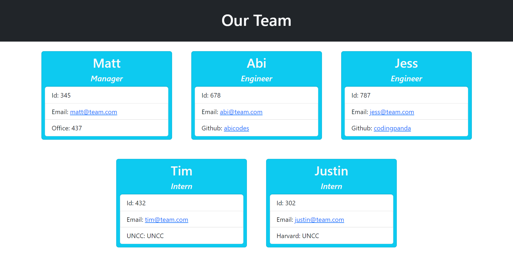
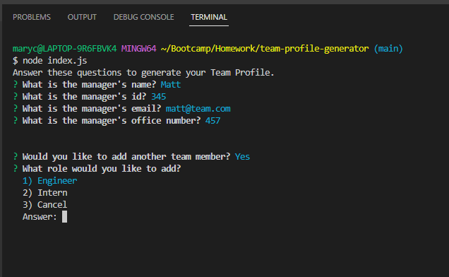

# Team Profile Generator

## Table of Contents

- [Description](#description)
- [Usage](#usage)
- [Visuals](#visuals)

## Description

This project uses node.js and the [Inquirer package](https://www.npmjs.com/package/inquirer#documentation) to generate a team roster HTML with information inputed by the user. After answering questions in the command line, the html is generated in the output folder. Users can input names, ids, and email addresses for each employee. Managers have an additional input of office number. Engineers have an additional input of GitHub Username. Interns have an additional input of school name.

Tests located in the ```_tests_``` folder use the [jest](https://jestjs.io/) developer dependency. Javascript classes and subclasses are located in the ```lib``` folder.

## Usage

[Instructional Video](https://drive.google.com/file/d/1iU0dU85HjltMJvvJut6rmc0MN3Zf56NO/view?usp=sharing)

After downloading the code, start the program by typing ```node index.js``` in the GitBash terminal. Follow the instructions in the console by answering the questions and adding more team members as needed. When prompted to select from a list of employees, use the keyboard's arrow keys to scroll up and down to the desired item before pressing enter. Alternatively, select the list item by pressing its associated number before pressing enter.

Typing ```n``` when prompted to add an additional member will generate the HTML. Similarly, selecting ```Cancel``` in the rawlist of roles will generate the HTML.

## Visuals

[Sample HTML](https://raw.githubusercontent.com/mycancel/team-profile-generator/main/output/index.html)



